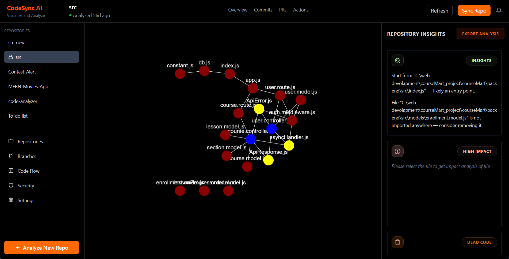

<h1 align="center">CodeSync</h1>

> From code chaos to clarity.

---

Code Analyzer is a CLI tool + interactive dashboard that helps you understand your codebase by analyzing dependencies, complexity, and impact before making changes.

---

## Why Code Analyzer?

Understanding large codebases is slow and error-prone.

Code Analyzer helps you:

- Visualize your codebase as a dependency graph  
- Identify complex and high-risk files  
- Detect circular dependencies  
- Understand impact before making changes  
- Find unused (dead) code  

## Quick Start

Run instantly using `npx`:

```bash
npx @kundangosavii/codesync
```
OR
```bash
npm install -g @kundangosavi/codesync
codesync
```

## What it does

- Builds a dependency graph of your code
- Detects circular dependencies
- Calculates complexity scores
- Finds unused files
- Provides impact analysis

## Dashboard

Launch the interactive dashboard:

```bash 
codesync dashboard
```


- Visual graph of your codebase
- Click nodes to explore dependencies
- View impact and complexity insights
- Get AI insights

## Commands

```bash
codesync analyze <path>

codesync detail-analysis <path>

codesync complexity <path>

codesync cycles <path>

codesync depth-table <path>

codesync dashboard
```

Use --json for machine-readable output.

## How it works
1. Parses your codebase
2. Builds dependency relationships
3. Computes graph structure
4. Extracts insights (complexity, cycles, impact)

## Use Cases
- Understanding unfamiliar codebases
- Safe refactoring
- Debugging dependency issues
- Identifying technical debt

## Requirements
- Node.js 18+
- JavaScript / TypeScript project

## Documentation

Full docs available at:

👉 https://kundangosavii.github.io/CodeSync/

## Roadmap
- Multi-language support (Python, C++, etc.)
- Config file support
- Advanced filtering and insights
- Performance optimization

## Contributing

Contributions are welcome.

- Open an issue
- Submit a PR
- Suggest improvements

## License

MIT License

## Author

Built by Kundan Gosavi